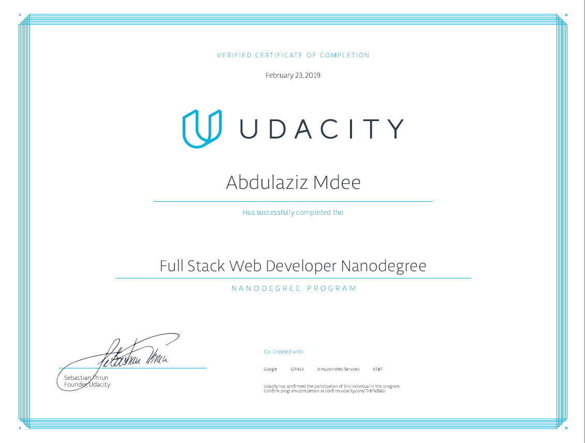

# [Full Stack Web Developer Nanodegree](https://www.udacity.com/course/full-stack-web-developer-nanodegree--nd004)

---

## About

This repisitory contains all my projects for [Full Stack Web Developer Nanodegree](https://www.udacity.com/course/full-stack-web-developer-nanodegree--nd004).

## [Syllabus](/Full-Stack-Nanodegree-Udacity/Syllabus.pdf)

## Projects

* [Project 1: Logs Analysis](#Logs-Analysis)
* [Project 2: Item Catalogs](#Item-Catalogs)
* [Project 3: Linux Server Configuration](#Linux-Server-Configuration)
